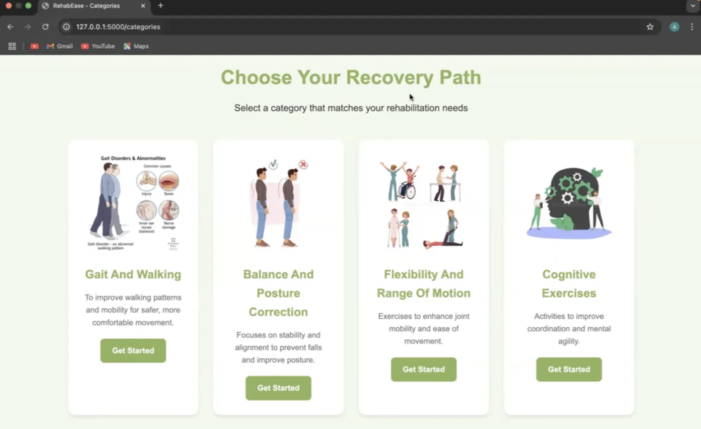
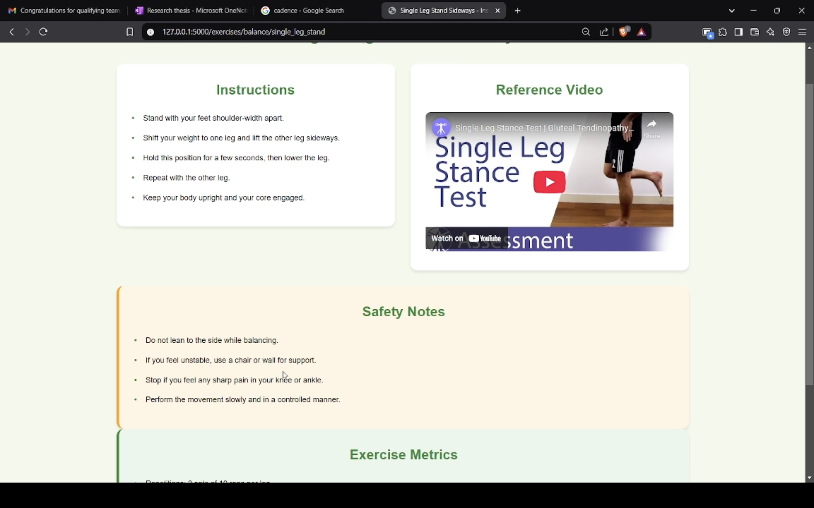
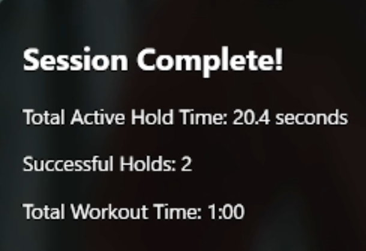

# RehabEase — AI Physiotherapy Assistant

> Can AI replace the physiotherapist's eyes during home rehabilitation?

RehabEase is a real-time AI-powered physiotherapy assistant that tracks your body movements through a phone camera, compares them against clinical exercise templates, and delivers corrective feedback — no physiotherapist physically present required.

---

## Screenshots

<table>
  <tr>
    <td align="center">
      
      <br/><sub><b>Choose Your Recovery Path</b></sub>
    </td>
    <td align="center">
      
      <br/><sub><b>Exercise Instructions + Reference Video</b></sub>
    </td>
  </tr>
  <tr>
    <td align="center">
      
      <br/><sub><b>Session Complete — Live Stats</b></sub>
    </td>
  </tr>
</table>

---

## What it does

- **Real-time pose tracking** — MediaPipe BlazePose detects 33 full-body landmarks at 30fps with no GPU required
- **Corrective feedback** — Custom algorithms measure joint angles and flag deviations from correct exercise form in real time
- **Reference videos** — Each exercise includes a curated reference video alongside step-by-step instructions
- **Safety guidance** — Built-in safety notes per exercise to prevent injury during unsupervised sessions
- **Session analytics** — Tracks active hold time, successful reps, and total workout duration per session
- **Multilingual voice guidance** — Text-to-speech prompts guide users through exercises in multiple languages
- **Progress tracking** — Session data synced to Firebase for longitudinal tracking
- **Neuro + orthopedic support** — Protocols across Gait & Walking, Balance & Posture, Flexibility, and Cognitive exercise categories

---

## Tech stack

| Layer | Technology |
|---|---|
| Mobile frontend | Flutter |
| Backend | Flask (Python) |
| Pose estimation | MediaPipe BlazePose, OpenCV |
| Database & auth | Firebase |

---

## How it works

```
Camera feed → MediaPipe (33-landmark pose) → Joint angle extraction
                                                      ↓
                                          Compare vs exercise template
                                                      ↓
                                     Real-time corrective feedback (TTS)
                                                      ↓
                                        Firebase (session + progress log)
```

1. The Flutter app streams frames to the Flask backend
2. MediaPipe extracts 33 3D body landmarks per frame
3. Custom angle-comparison logic checks each joint against the target range for the active exercise
4. Deviations trigger voice feedback (e.g. "straighten your knee", "raise your arm higher")
5. Rep counts, hold times, and accuracy scores are logged to Firebase after each session

---

## Getting started

### Prerequisites

- Python 3.9+
- Flutter SDK
- Firebase project (Firestore + Auth enabled)

### Backend

```bash
git clone https://github.com/Nyasa11/RehabEase.git
cd RehabEase
pip install -r requirements.txt
python app.py
```

### Frontend

```bash
cd flutter_app
flutter pub get
flutter run
```

> Update `lib/config.dart` with your Firebase credentials and backend URL before running.

---

## Project structure

```
RehabEase/
├── app.py               # Flask backend — pose processing & feedback logic
├── exercises/           # Exercise templates (joint angle ranges per protocol)
├── static/              # Static assets
├── templates/           # HTML templates
├── assets/              # README screenshots

---

## Status

Active development. Core pose tracking, exercise instructions, safety guidance, and session analytics are functional. Multilingual TTS and Firebase progress sync in integration.
